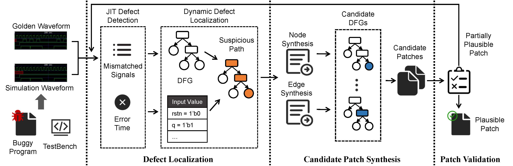

# Strider: Signal Value Transition-Guided Defect Repair for Hardware Design Code

- [Strider: Signal Value Transition-Guided Defect Repair for Hardware Design Code](#strider-signal-value-transition-guided-defect-repair-for-hardware-design-code)
    - [1. Strider Framework](#1-strider-framework)
    - [2. Reproduction](#2-reproduction)
        - [2.1. Downloading the Repository](#21-downloading-the-repository)
        - [2.2. Configuration](#22-configuration)
        - [2.3. Execution](#23-execution)
    - [3. Structure](#3-structure)
    - [4. LICENSE](#4-license)

This repository consits of all relevant artifacts of Strider.

## 1. Strider Framework

The framework of Strider is present as follows:



We aim to contribute an APR technique toward Verilog programs that leverages signal value transition. We release the complete source code Strider that covers the whole automated defect repair pipeline, including defect localization, patch synthesis and patch validation. We hope the publicly available implementation could facilitate follow-up research towards hardware deisign code.

## 2. Reproduction

### 2.1. Downloading the Repository

Use the following command to download the artifact repository:

```
git clone https://github.com/ASPLOS2023-apr/STRIDER.git
```

### 2.2. Configuration

To run Strider, you will need to compile `Pyverilog` if you have not done so already:
```
make
```

And instanll the following python packages
```
pip install dataclasses PyVCD
```

Unzip the `cirfix_benchmarks` and `Assignments4V` dataset:
```
cd benchmarks;
unzip cirfix_benchmarks;
unzip Assignments4V;
```

We use the following tools for compilation and simulation of Verilog code:

* Icarus Verilog: `sudo apt-get install iverilog` (for Ubuntu)
* Synopsys VCS (Commercial license)

### 2.3. Execution

Our prototype of Strider needs three input options for execution:

* `--benchmark/-b`: the benchmark name. (`cirfix_benchmarks` for the example)
* `--project/-p`: the project name of defective program of the benchmakr. (`fsm_full` for the example)
* `--version/-v`: the identifier of the defective program. (`1` for the example)

```
Example: python strider/Main.py -b cirfix_benchmarks -p fsm_full -v 1
```

## 3. Structure

```yaml
STRIDER
├── benchmarks
│   ├── Assignments4V:          data directory of Assignments4V
│   ├── Assignments4V.conf:     configuration file of Assignments4V
│   ├── cirfix_benchmarks:      data directory of cirfix_benchmarks
│   └── cirfix_benchmarks.conf: configuration file of cirfix_benchmarks
├── doc
│   └── figs:                   figure of Strider framework
├── libs
│   └── Pyverilog
├── logs
├── patch
│   ├── Assignments4V:          patches generated by Strider for Assignments4V
│   └── cirfix_benchmarks:      patches generated by Strider for cirfix_benchmarks
└── strider:                    source code of Strider
    ├── Adapter
    ├── Benchmark
    ├── Locator
    ├── utils
    ├── VerilogAnalyzer
    ├── Main.py
    ├── Repair.py
    └── Config.py
```

P.S. The dataset of `cirfix_benchmarks` is from [the benchmark of CirFix](https://github.com/hammad-a/verilog_repair/tree/master/benchmarks)